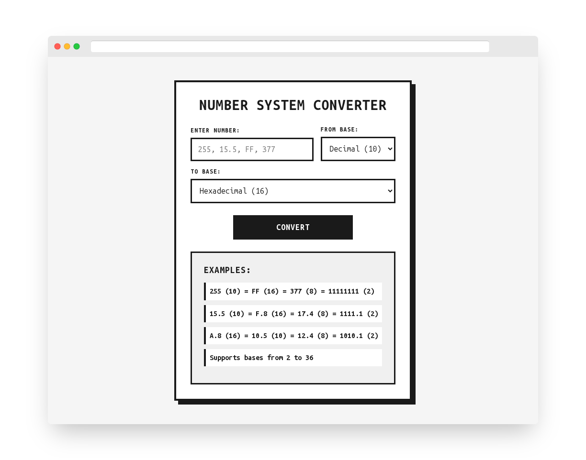

# Base Converter WebApp

[](https://github.com/ChernegaSergiy/baseconverter-webapp/actions/workflows/deploy.yml)
[](LICENSE)


Welcome to the Base Converter WebApp repository. This project is a versatile tool for converting numbers between various numeral systems, built with Next.js.



## Features

- **Wide Range of Bases**: Convert numbers between any base from 2 to 36.
- **Handles Fractional Numbers**: Accurately converts numbers with decimal points.
- **Detailed Steps**: Shows the full, step-by-step process for each conversion, making it a great educational tool.
- **Responsive Design**: A clean, modern interface that works on both desktop and mobile.

## Technologies Used

- **Next.js**
- **React**
- **JavaScript**
- **CSS**

## Getting Started

To get a local copy up and running, follow these simple steps.

### Prerequisites

Make sure you have the following installed:

- Node.js
- npm (comes with Node.js)

### Installation

1. Clone the repo:
   ```bash
   git clone https://github.com/ChernegaSergiy/baseconverter-webapp.git
   ```
2. Install NPM packages:
   ```bash
   npm install
   ```

### Usage

To start the development server:

```bash
npm run dev
```

Open [http://localhost:3000](http://localhost:3000) with your browser to see the result.

### Deployment

This project is intended to be deployed on GitHub Pages.

## Contributing

Contributions are welcome and appreciated! Here's how you can contribute:

1. Fork the project
2. Create your feature branch (`git checkout -b feature/AmazingFeature`)
3. Commit your changes (`git commit -m 'Add some AmazingFeature'`)
4. Push to the branch (`git push origin feature/AmazingFeature`)
5. Open a Pull Request

Please make sure to update tests as appropriate and adhere to the existing coding style.

## License

This project is licensed under the CSSM Unlimited License v2.0 (CSSM-ULv2). See the [LICENSE](LICENSE) file for details.
